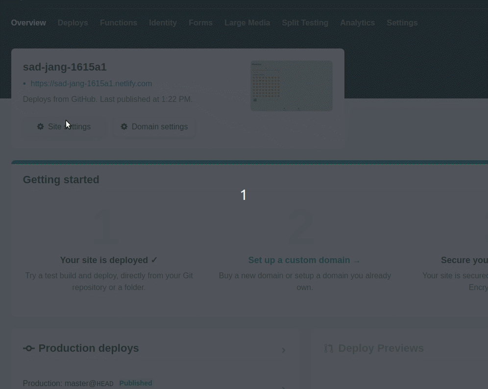

## Intro
In this post, I will walk you through building a mood tracker app with typescript, ionic, react and mobx. We will then make it publicly accessible by deploying the app on netlify.

I have been building apps with ionic for around 4 years now and I still think it is a very impressive tool to have in your kit. It's shiny, cutting edge, full of features, developer-friendly and honestly, the list would go on. I find it amazing how the ionic team, after 4 years, still keeps the momentum and ships features and tools to empower its userbase. React integration is one such feature that I believe is going to turn a lot of head in the dev community towards ionic and its ecosystem. 

Ionic has been historically angular/typescript based and while it's core is still developed with angular, they have recently spent a LOT of time and resources to integrate frameworks like react and vue to lower the entry bar for developers of all tastes. I personally have no agenda against angular but I would be lying if I said I don't prefer react to it. So, naturally, as soon as they announced react integration, I jumped right in and started playing with it. So far the ease of use and the plethora of components seems too good to be true.

If you're familiar with my blogging style, you know that I am a firm believer of the "learning by building" approach. I like to get my hands dirty, make mistakes and figure things out on my own instead of memorizing the documentation before using a new tool. If that sounds like a good approach to you then please, do read on.

## For the impatients
Ain't nobody got time for reading a ~7K word blog post without knowing what they are getting into. So, for the impatients (like me):

- Here's the git repo that contains the entire app: [https://github.com/foysalit/moodular-ionic](https://github.com/foysalit/moodular-ionic)
- Here's the app itself for you to take it for a quick spin: [https://moodular.netlify.com](https://moodular.netlify.com). I recommend using a your mobile device to access it since it's only optimized for mobile viewing. However, it should also work on your desktop browser.
- Here's a quick look at the end product:


## Who is this for?
In order to follow this post, I would expect you to:

- be running a *nix based system (linux or macOS), sorry windows people (I know, it's almost 2020, I should get off my high horse, right?).
- have basic understanding of npm, typescript and react.
- have some familiarity with terminal and web development in general.
- have your development environment setup with at least android studio and xcode.
- understand that all of the above rules are some authoritarian propaganda to stop you from reaching the supreme height in your career and I'm not your mom so I can't really tell you what you can and can't do so it's entirely upto you if you want to set sail on this epic journey or not. 

## Scaffolding
First thing you need is, ionic npm package installed on your machine. Running `npm install -g ionic@latest` command on your terminal should get that sorted for you. Now `cd` into the directory where you want to create your ionic app folder and run `ionic start moodular blank --type=react` command. This will drop a new folder called *moodular* with a bunch of files and folders in it and the output of the command will give you a preview of what to do next. Below is what I'm seeing at the time of writing this post. 


Let's do what ionic told us to do:

```bash
cd ./moodular
ionic serve
```

It should automatically open [http://localhost:8100/home](http://localhost:8100/home) in your browser. If it doesn't, open a new tab and navigate to that page in your browser to see it in action. Beautiful, right...? nah! you're right, it's embarrassing. Let's make it better, let's get coding!

## Tabs and pages
Let's think through our app's feature for a second. For this very minimalistic app, we will need two pages. The page that loads when I first open the page, I wanna be able to log my current mood. Then, we will need another page where I can go through my previously logged moods, a history page if you will. To allow navigating between the pages, we will use a bottom tab navigation. 

The scaffolding in the previous page already gave us a page in the `src/pages/Home.tsx` file. Let's create one more file in the folder: `touch src/pages/History.tsx` and paste in the following code in that new file:

```typescript
import { IonContent, IonPage } from '@ionic/react';
import React from 'react';

const History: React.FC = () => {
    return (
        <IonPage>
            <IonContent className="ion-padding">
                <p>History page</p>
            </IonContent>
        </IonPage>
    );
};

export default History;
```

Here, we are creating a react functional component named `History` and exporting it. The component renders a `IonPage` component with `IonContent` inside it. These components are layout building block components provided by ionic out of the box. I just copy pasted those from the autogenerated `Home.tsx` file and stripped some of the unnecessary markup.

Now that we have both the pages, let's show a footer tab bar and so that users can navigate between the pages. We want our tab bar to be available in every page so it would make sense for it to be in a generic place. We will put it in the `src/App.tsx` file. Open that file and *replace* the `App` component's internal with the following:

```typescript
    <IonApp>
        <IonReactRouter>
            <IonTabs>
                <IonRouterOutlet>
                    <Route path="/today" component={Home} exact={true} />
                    <Route path="/history" component={History} exact={true} />
                    <Route
                        exact
                        path="/"
                        render={() => <Redirect to="/today" />}
                    />
                </IonRouterOutlet>

                <IonTabBar slot="bottom">
                    <IonTabButton tab="today" href="/today">
                        <IonIcon icon={calendarIcon} />
                        <IonLabel>Today</IonLabel>
                    </IonTabButton>

                    <IonTabButton tab="history" href="/history">
                        <IonIcon icon={happyIcon} />
                        <IonLabel>History</IonLabel>
                    </IonTabButton>
                </IonTabBar>
            </IonTabs>
        </IonReactRouter>
    </IonApp>
```

We are using a few new ionic components here that weren't there before so we have to make sure they're imported properly. Scroll back up to the top of the file and find the line that looks like `import {...} from '@ionic/react'` and replace that with this: 

```typescript
import { IonApp, IonRouterOutlet, IonTabs, IonTabBar, IonTabButton, IonIcon, IonLabel } from '@ionic/react';
```

Now, let's break down the code and see what we are doing:

### IonRouterOutlet

```typescript
<IonRouterOutlet>
    <Route path="/today" component={Home} exact={true} />
    <Route path="/history" component={History} exact={true} />
    <Route
        exact
        path="/"
        render={() => <Redirect to="/today" />}
    />
</IonRouterOutlet>
```

This component let's you define your routes/pages for your app. It's children need to be `<Route>` components with a `path`, `component` prop at the least. `path` prop tells ionic what the url will look like when the route is hit and the `component` defines which component will be rendered when that url/route is hit. In our code, we have defined two routes, for 2 of our pages `Home` and `History`. *Notice* that we haven't imported our newly created `History` component yet, so let's go back to the top again and import it right after our `Home` import:

```typescript
import Home from './pages/Home';
import History from './pages/History';
```

The third `<Route>` here is a default catcher that says, if the user does not specify a route, take them to `/today` by default using the `<Redirect>`, which in turn, of course, renders our `Home` component.

You can read on about routing in ionic [here](https://ionicframework.com/docs/api/router).

*Note* : This is just using `react-router-dom` package and has nothing to do with ionic itself so if you're familiar with react ecosystem, this should look familiar to you.

### IonTabBar

```typescript
<IonTabBar slot="bottom">
    <IonTabButton tab="today" href="/today">
        <IonIcon icon={calendarIcon} />
        <IonLabel>Today</IonLabel>
    </IonTabButton>

    <IonTabButton tab="history" href="/history">
        <IonIcon icon={happyIcon} />
        <IonLabel>History</IonLabel>
    </IonTabButton>
</IonTabBar>
```

This component creates tab bar that you can either put at the top or the bottom of your page using the `slot` prop. Inside the component, we are rendering 2 `IonTabButton` components that each contain an icon and text. Each of the buttons specify an `href` prop that pretty much works as a link button so when you tap on them, the browser will take you to the designated url. Here, the `href` values has to match with the `path` prop values we defined for our `<Route>` components.

The icons are rendered using `IonIcon` component where the `icon` prop specifies which icon to show. We need to import those icons from the `ionicons` package. Add the following import near the top of the file:

```typescript
import { calendar as calendarIcon, happy as happyIcon } from 'ionicons/icons';
```

> Read more about [ionicons](https://ionicons.com/) and [tab bar component](https://ionicframework.com/docs/api/tab-bar).

### IonTabs
Finally, we wrap all of that in `IonTabs` component which *needs* to be inside `IonReactRouter` component for the navigation to work properly. 

Let's checkout what we have done so far. Going back to the browser, you should see something like this:


That wasn't that complicated, right? With the help of a few out of the box tools, we setup a seamless navigation between two pages that works through browser URL.

## Best invention of the 21st Century: Emojis!
Ok may be that's a bit of an over-exaggeration but you can't deny how inter-twined our daily lives are with emojis these days. There's always an emojis for almost everything you want to say. So for this app, we will use emojis to represent our moods. We will use [emoji mart](https://github.com/missive/emoji-mart) to let our users select emojis. First thing, of course, install the package: `npm install --save emoji-mart` and since we are going to be using it through typescript, we will need to run `npm i --save-dev @types/emoji-mart` to install the types for that package. 

For this package to work, we need to include it's stylesheet. Let's add that in the `src/App.tsx` file where other css files are included: 

```typescript
/* Third party styles */
import "emoji-mart/css/emoji-mart.css";
```

Now, let's open the `src/pages/Home.tsx` file and get rid of the autogenerated content to put in our emoji picker in it:

```typescript

// ... other imports
import { Picker } from "emoji-mart";

// ... component definition
<IonPage>
    <IonContent className="ion-padding">
        <h2>
            Moodular
        </h2>

        <Picker
            title="Pick your mood"
            include={["people"]}
        />
    </IonContent>
</IonPage>
```

In the `Picker` component, we are passing the `include` prop to make sure that only the "people" emoji set shows up in the picker. At this point, in the home page, you should see the emoji picker like below:


## Data and state
Heads up, things will get a bit more muddy now. Scaffolding and layouts are usually the easier side of an app when compared to data and state management. I don't want this post to be your intro to Data science or Big data so I'll keep it minimal. All our data will be stored in browser's localstorage and for reactively managing state, we will use [mobx](https://mobx.js.org/). But before we get into those, let's think through the behavior we want to implement. As a user, I would like to select an emoji that represents my current mood and additionally, I would want to write a brief note regarding my mood and may be set a date for the entry just in case we want to track mood from a past date. Once logged, the mood entry should go into a list of my previously logged moods so that I can see them listed in the history page.

With the above consideration, we can conclude that each mood can be an `object` with an `emoji`, a `details` and a `date` property. To give every entry a unique identifier, we will add an `id` property to the mood object as well.

Let's create a `MoodService.ts` file in the `src/pages/` folder. I know that's not an ideal place for a service file but we don't have a lot of modules for this app so let's leave it there for now. Add the following code in it:

```typescript
import { EmojiData } from "emoji-mart";
import { persist } from "mobx-persist";
import { observable, computed, action } from "mobx";

export interface Mood {
    emoji: EmojiData,
    details: string,
    date: Date,
    id: number,
};

export class MoodStore {
    @persist('list')
    @observable
    list: Mood[] = [];

    @computed get entries(): Mood[] {
        const sortFunc = (firstItem: Mood, secondItem: Mood): number => {
            if (firstItem.id > secondItem.id)
                return 1;

            if (firstItem.id < secondItem.id)
                return -1;

            return 0;
        };

        return this.list.slice().sort(sortFunc);
    };

    @action
    save(emoji: EmojiData, details: string, date: Date) {
        this.list.push({emoji, details, date, id: Date.now()});
    };

    @action
    remove(moodId: number) {
        const moodIndex = this.list.findIndex(({ id }) => moodId === id);
        this.list.splice(moodIndex, 1);
    };
};
```

That's a **lot** to take in but don't worry we will break it down into manageable bits and go through them one by one. Before we do that, please go to the [mobx website](https://mobx.js.org/) and read their summary, concepts and principals to at least have a basic understanding of why this package exists and why it is used. Oh and don't forget to install the 2 new packages we are importing in this file first: `npm install --save mobx mobx-persist`.

First thing you will notice is the `Mood` interface. As planned above, we have the necessary properties defined in this interface and it will be used as a single mood entity logged by the user. Noteworthy thing here is the `EmojiData` type. Each emoji in the `emoji-mart` package is represented as `EmojiData`. 

### Observables

```typescript
    @persist('list')
    @observable
    list: Mood[] = [];
```

Here, We are creating a `MoodStore` class which will be our main state container for the app. It has one `observable` property `list` which is an array of `Mood` entries. Using the `@observable` decorator, we are telling mobx to keep track of changes made to this property. Using the `@persist('list')` decorator, we are telling `mobx-persist` package to save this array in browser's localstorage and the `list` parameter tells the persistor that this property is an array.

**Decorator** are not yet universally used so you might need to tell ionic's typescript compiler to recognize the user of it in your code. Add `"experimentalDecorators": true` to the `compilerOptions` property in the `tsconfig.json` file in the root of the project.


### Actions

```typescript
    @action
    save(emoji: EmojiData, details: string, date: Date) {
        this.list.push({emoji, details, date, id: Date.now()});
    };

    @action
    remove(moodId: number) {
        const moodIndex = this.list.findIndex(({ id }) => moodId === id);
        this.list.splice(moodIndex, 1);
    };
```

`MoodStore` also has a couple of *actions* that are essentially operations on the store's data. Quite apparent from the name of the actions that `save` action adds a new mood to the list and `remove` action removes a mood from the list. We are simply using javascript array manipulation methods to perform those actions in this case but eventually, you would hook it up with a server api or a local database for persistance.

When calling `save`, we have to remember to pass it `emoji`, `details` and `date` then the method will fill in the `id` property automatically.

For remove, we only need to pass in the `id` of the mood entry.

### Computed properties

```typescript
    @computed get entries(): Mood[] {
        const sortFunc = (firstItem: Mood, secondItem: Mood): number => {
            if (firstItem.id > secondItem.id)
                return 1;

            if (firstItem.id < secondItem.id)
                return -1;

            return 0;
        };

        return this.list.slice().sort(sortFunc);
    };
```

In mobx, we use observables to keep data in raw state. For display purposes, we might need to access and derive different representations of the data in various ways which is where `@computed` properties come in. They let you define properties that return a derived/computed version from a store's raw data. In this case, we define an `entries` property which sorts the observable `list` araay and then sorts it by it's date property. When displaying our previously logged moods in the history page, we will use this property to show moods in the right chronological order.

*Notice* we are doing `slice()` on the `list` array because javascript sort is *mutating* and directly mutating an `@observable` array can cause all sorts of problems.

This is pretty much the core of the entire data/state management system of our app. Pretty concise, right? I hope the explanation above helped you understand it but don't worry if it didn't. We will slowly start integrating thise service into our `Home` and `History` components and then it will become more apparent why things are the way that they are in this file.

## Connecting mobx store
Right now, our `MoodService` exists in vaccum, in the sense that none of our pages/components of our app is using the store. Let's fix that. We need a new package `mobx-react` for that. Install that using: `npm i --save mobx-react`. Then, open the `src/App.tsx` file and wrap the `IonicReactRouter` component like this:

```typescript
//... other imports 
import { Provider } from "mobx-react";
import { create } from "mobx-persist";

//... other imports
import { MoodStore } from "./pages/MoodService";

//... other imports
const App: React.FC = () => {
    const hydrate = create({});
    const moodStore = new MoodStore();

    hydrate("moodStore", moodStore);
    
    return (
        <IonApp>
            <Provider moodStore={moodStore}>
                <IonReactRouter>
                //....tabs and other components
                </IonReactRouter>
            </Provider>
        </IonApp>
    );
};
```

First we are instantiating our `MoodStore`. Then we are hydrating the `moodStore` instance to ensure that on first load, `mobx-persist` loads up previously saved state of the store from localstorage. It looks a bit complicated with all the functional programming mumbo-jumbo and terms like ***hydrating*** but in plain english: if we close our app and reopen it or close the browser tab and reopen it, all our previously saved moods will still be there in the moodStore instance. The `Provider` component makes our `moodStore` instance available as props to the internal components. 

This only connects our pages with the mobx store but we are not using the store in our pages.... yet. Let's open the `src/pages/History.tsx` page. We will assume the moodStore instance has a bunch of moods in the `list` property and we will show all the entries in the history page since we already know how each of those mood entries will look like and how to access that from the store.

...Still with me? I hope so. We have done so much so far and you deserve a break. Go have a walk, drink a glass of the liquid of your choice and then come back to continue on with the rest of the post.

.....
....
... Back? Alright, let's finish it off.

## Saving mood with mobx
Now we get to play more with the magic of react's and mobx's state management. We will start with the `src/pages/Home.tsx` file. When users tap on an emoji, we will show a popup where additional details text and a date for the mood entry can be specified. We will use the `IonAlert` [component](https://ionicframework.com/docs/api/alert) for this:

```typescript
    <Picker 
        title="Moodular"
        include={["people"]} 
        onSelect={handleEmojiSelect} 
    />

    <IonAlert
        isOpen={showInputs}
        subHeader="Add more details or set the time/date for your mood"
        onDidDismiss={() => setShowInputs(false)}
        header={`Add Details`}
        inputs={[
            {
                type: "text",
                name: "details",
                placeholder: "Write out how you are feeling..."
            },
            {
                name: "date",
                type: "date",
                max: `{new Date()}`,
                min: "2017-09-09",
                value: new Date(),
                placeholder: "Change date"
            }
        ]}
        buttons={[
            {
                text: "Cancel",
                role: "cancel",
                cssClass: "secondary",
                handler: () => {
                    setShowInputs(false);
                    setEmoji(null);
                }
            },
            {
                text: "Ok",
                handler: data => {
                    moodStore.save(emoji, data.details, data.date)
                }
            }
        ]}
    />
```

Before we look break down this code, let's *import* `IonAlert` from `@ionic/react` at the top of our file: `import { IonContent, IonPage, IonAlert } from '@ionic/react';`

First change in our existing code is, the new `onSelect` prop in the `<Picker>` component and it takes a function as it's value. We are giving it the function `handleEmojiSelect` function that we haven't defined yet. Before we define that, let's take a quick look at the `IonAlert` component. It's `isOpen` prop determines if the alertbox should be on display or not. We want to show the alertbox when an emoji is tapped, right? So naturally, the value of `isOpen` should be a *state variable* that is toggled between `true` and `false` based on user interaction. Also, we won't be logging the mood entry as soon as the emoji is tapped. We will only log it after getting confirmation from the user through the alertbox with additional details. So, to keep the selected emoji memorized while user fills in other details through the alertbox, we will need another state variable. We will use the `useState` react hook to define that variable and we will define our `handleEmojiSelect` function to modify those state variables accordingly. Add the following code right above the return statement in the page component.

```typescript
    const [showInputs, setShowInputs] = useState(false);
    const [emoji, setEmoji] = useState<any>(null);

    const handleEmojiSelect = (selection: EmojiData) => {
        setEmoji(selection);
        setShowInputs(true);
    };

    return (
        <IonPage>
```

`useState` needs to be imported from react, so add that to the react import line: `import React, { useState } from 'react';`. As explained above, the value of `isOpen` is the `showInputs` state variable which is initially set to `false`, so the alert will not be showing up on first load. To contain selected emoji, we create the other state variable aptly named, `emoji`. Then of course, we define our `handleEmojiSelect` function to take one parameter, the selected emoji and then the function stores the emoji in state and toggles the `showInputs` state to `true`. At this point the alertbox should show up. *Note* we are defining the type of `selection` to be `EmojiData` but we haven't imported it yet. Make sure you add that to the import statement from `emoji-mart`: `import { Picker, EmojiData } from "emoji-mart";`. 

Now, let's take a look at the content of our alertbox. We give it a `header` and a `subHeader` to show some instruction texts for the user. The `onDidDismiss` component is a function that is called when user closes the alertbox. We simply toggle our `showInputs` state variable back to `false` in that function. The most interesting part of this component are the `inputs` and `buttons` props. They allows us to add action buttons and various types of input fields to the alertbox. In this case, we are adding 2 inputs. First input is the details text field and the second one is a date picker. *Pay attention* to the `name` properties in these, we will need them in a bit.

We have 2 action buttons to either confirm and save the mood entry or cancel and discard the entry. Naturally, when cancel is clicked, we simply toggle `showInputs` back to `false` so that the alertbox goes away and then empty out the emoji selection by setting the `emoji` state variable to null. The confirm button, however, calls a function with all the input field values encapsulated in the `data` object, where the object properties match the `name` we gave to each of the `inputs`. Following our definitions, we will have `data.details` and `data.date`. Within the function, we are using the `save` action method we defined in our mood store and pass the `emoji` from state variable and the other parameters from `data` variable. However, you will notice that within the `Home` component, we don't have access to the `moodStore` instance, right? *Good catch*. Remember all the setup we did in our `src/App.tsx` file with `Provider` and `hydration` and store instances? This is where those come into play. 

First, we need to `import { inject, observer } from "mobx-react";` at the top of our file and then replace `export default Home` at the bottom of the file with: `export default inject("moodStore")(observer(Home));`. This looks confusing, I know, but you can see it as boilerplate code that you will just copy paste. In plain english, it means: Make the `Home` component an observer of mobx store and specifically give it access to a store named `moodStore`. Mobx knows where to get `moodStore` from because in our `<Provider>` component, we passed it a prop named `moodStore` with the value being an instance of our `MoodStore` mobx store. With this in place, we now have access to `moodStore` within our component as a prop. Since we are using typescript, we *have to* tell the compiler that the `Home` component *can* actually get a prop named `moodStore` *provided* to it. We do that by replacing `const Home: React.FC = () => {` with the following:

```typescript
import { MoodStore } from "./MoodService";

type HomeProps = {
    moodStore: MoodStore,
};

const Home: React.FC<HomeProps> = ({ moodStore }) => {
```

That's it for the Home page. You should now be able to log a mood entry like this:


It's good and all but how do we know if our mood is actually being stored or not? Well, untill we make them appear in our History page, we need to resort to looking under the hood. Remember we used a library called `mobx-persist`? That library will take our input, specifically, the `list` property of our `moodStore` and save it in the localstorage of the browser. The below screenshot should help you figure out how to look into that and sure enough, you see the mood entry in there:


## Showing mood history
You and I, being the smartest programmers of the world, can easily look under the hood of a running machine that is our app right now and consume raw JSON data but we need to spare more thoughts about our users, right? So, let's fill in our history page to show the perviously logged moods as we've planned in the beginning.

Having learned our lesson about typescript and react components and mobx provider, this time, we will start by ensuring that our History page component is all set to receive the `moodStore` component:

```typescript
import { inject, observer } from "mobx-react";
import { MoodStore } from "./MoodService";

type HistoryProps = {
    moodStore: MoodStore;
};


const History: React.FC<HistoryProps> = ({ moodStore }) => {
    //... component code
};
export default inject("moodStore")(observer(History));
```

Now that we have access to our mobx store, we can simply use the computed `entries` obserable array of moods. We will use `IonList` [component](https://ionicframework.com/docs/api/list) to show the moods:

```typescript
//... other imports

import { Emoji } from "emoji-mart";
import { trash as trashIcon } from "ionicons/icons";

//... previous code

            <IonContent>
                <IonList>
                    {moodStore.entries.map(mood => (
                        <IonItemSliding key={mood.id}>
                            <IonItem>
                                <IonAvatar>
                                    <Emoji emoji={mood.emoji} size={30} />
                                </IonAvatar>
                                <IonLabel>
                                    <h3>{printDate(mood.date)}</h3>
                                    <p>{mood.details || "No Details"}</p>
                                </IonLabel>
                            </IonItem>{" "}
                            <IonItemOptions side="end">
                                <IonItemOption
                                    color="danger"
                                    onClick={() => setRemovingMoodId(mood.id)}
                                >
                                    <IonIcon icon={trashIcon} />
                                </IonItemOption>
                            </IonItemOptions>
                        </IonItemSliding>
                    ))}
                </IonList>
            </IonContent>
```

Let's take a closer look at what we are doing here, shall we? Within the `IonList` component, we are mapping through the `entries` list and rendering `IonItemSliding` components for each mood entry. This component takes a `IonItem` component and a `IonItemOptions` component as it's children. The `IonItem` component is what we will see for each mood and the `IonItemOptions` component is what we will see when we swipe the items to the left because we set `side="end"` prop. Within the `IonItemOptions` component, we have one option that displays a button with an icon in it and when the button is tapped on, we are executing a `setRemovingMoodId` function. We will get back to it in a bit. 

The `IonItem` component shows an avatar on the left which simply shows the emoji that expresses our mood and details text with the date of the mood on the right of the avatar. If there is not details text attached to the entry, we simply show `No Details` text just so the item doesn't look very empty. To display the date, we are using a helper function `printDate` because of 2 reasons:

1. Dates are hard! Javascript has a `Date` primitive but when it needs to be saved in a storage that doesn't support it, it gets converted into a string. In our case, when mobx saves date in the browser's localstorage, it converts it into string so when we access the date of a mood entry from storage, it's in string format but when the user enters it, it's a `Date` instance.
2. Dates are used in various formats across the world and to show it to users in their own locale, we will use the `toLocaleDateString()` method built into the date object in Javascript.

To abstract away this complexities, we define a helper function `printDate` outside of the component like below:

```typescript
const printDate = (date: Date | string): string => {
    if (typeof date === "string") {
        date = new Date(date);
    }

    return date.toLocaleDateString();
};
```

It takes in a date value, in either `string` or `Date` format. If it's a string, it creates a `Date` instance out of it. Then it returns the localized version of the date as output of the function.

## Removing mood from history
We have already setup a way to remove a mood from history in our mobx store and we have given each mood entry a *swipe to show* a remove button. All we need to do is hook those two up with a good UX. As usual, let's sprinkle some react state magic with ionic component's fairy dust in our code. Add the following state variable at the top of the component definition and add a `IonAlert` component within the page:

```typescript
    const [removingMoodId, setRemovingMoodId] = useState<number>(0);

    return (
        <IonPage>
            <IonAlert
                isOpen={removingMoodId > 0}
                onDidDismiss={() => setRemovingMoodId(0)}
                header={"Remove Mood?"}
                message={`Sure you want to remove mood?`}
                buttons={[
                    {
                        text: "Cancel",
                        role: "cancel",
                        cssClass: "secondary",
                        handler: () => setRemovingMoodId(0)
                    },
                    {
                        text: "Yes, Remove It",
                        handler: () => {
                            moodStore.remove(removingMoodId);
                            setRemovingMoodId(0);
                        }
                    }
                ]}
            />
```
We are already setting the mood id to be removed in the `removingMoodId` state variable when the remove button is tapped on. The `IonAlert` component is only shown when `removingMoodId` has a number in it and contains some content that asks the user if they are certain that the mood should be removed. It has 2 buttons, one to confirm and one to cancel. The cancel, of course, simply sets `removingMoodId` to 0 which hides the alertbox. Tapping confirm will trigger 2 function calls. One that removes the mood entry from the moodStore using our previously created `remove` method and the other resets the `removingMoodId` state variable to hide the alertbox.

You have worked real hard to get to this point so give yourself a pat in the back and get yourself ready to see the beauty that we have created - 


EPIC! isn't it?

We have built a well functioning app that works but again, let's think about the users! Apps should be self explanatory and interactive. We are going to make a few improvements to bring up it's usability a notch. 

## Action Feedback
Have you ever tapped a button in an app and wondered what you've messed up cause it didn't do anything but you have that suspicious feeling that it did and chose not to tell you what? ...no? ok may be I'm just a bit paranoid but I like it when apps tell me when it does things, an *action feedback* if you will. In our case, let's add a feedback when user logs a mood entry.

Let's get back to the `src/pages/Home.tsx` file and add the following code right after the `Picker` component:

```typescript
    //...previously written code
 
    const [showMoodLoggedToast, setShowMoodLoggedToast] = useState<boolean>(false);
    const [showInputs, setShowInputs] = useState(false);

    //...previously written code

                <Picker
                    title="Pick your mood"
                    include={["people"]}
                    onSelect={handleEmojiSelect}
                />
                
                <IonToast
                    duration={2000}
                    isOpen={showMoodLoggedToast}
                    message="Your mood has been logged."
                    onDidDismiss={() => setShowMoodLoggedToast(false)}
                />

    //...previously written code

                        {
                            text: "Ok",
                            handler: data => {
                                moodStore.save(emoji, data.details, data.date);
                                setShowMoodLoggedToast(true);
                            }
                        }
```
We have added a `IonToast` [component](https://ionicframework.com/docs/api/toast) that shows up when `showMoodLoggedToast` state variable is true and then after `2 seconds` (2000ms) it disappears. Then all that we have to do is, make sure the toast shows up when a new mood is logged by calling `setShowMoodLoggedToast(true);` after saving a mood entry.

Now, if you go ahead and add a new mood from the home screen, you will see a small popup at the bottom of the screen saying `Your mood has been logged.`:


Much better, right? See, ionic has these very handy components right out of the box that just makes implementing a great user experience so much easier.

Another thing I noticed is that the History page looks really empty for the first time user since they won't have any mood logged just yet and those are our valuable users? the ones we want to convert into regular ones. An empty screen won't cut it for them would it? Let's spice it up a bit. 

## Empty state
I went on to [Undraw](https://undraw.co/) which is an absolute goldmine for non-designers like me for finding amazing illustrations for your web and mobile apps. Looked for a fitting illustration that represents empty state and personal mood at the same time and downloaded the svg file for it to put it in the `public/assets/` folder with the name `empty-state.svg`. Before we show the image in the History page, let's add a `@computed` property in our store to easily find out if we have an entry in the store or not. Open the `src/pages/MoodService.ts` file and add the following code in the `MoodService` class:

```typescript
    @computed get hasNoHistory(): boolean {
        return this.list.length < 1;
    };
```

Then in the `src/pages/History.tsx` file, we add a ternary if statement that shows the image using `IonImg` component if `hasNoHistory` is true, otherwise it shows the list of mood. `IonImg` will make sure that the image is nicely scaled for user's device screen size:

```typescript
            <IonContent>
                {moodStore.hasNoHistory ? (
                    <IonImg src="/assets/empty-state.svg" />
                ) : (
                    <IonList>
                    //...previously written code
                    </IonList>
                )}
```

No go back to the history page in your browser and remove all your mood entries to get a glorious view of the illustration like below:


---

That pretty much wraps up our application code. We have a solid feature that works seamlessly and provides a great user experience. However, this is still a web application for all we know. Let's turn it into a mobile application.

## Capacitor
Ionic team has been hard at work with their cordova alternative named [Capacitor](https://capacitor.ionicframework.com/) and I'm really optimistic about it's future after seeing their progress so far. I hope you will feel the same way by the end of this post. 

We will use capacitor to turn our web app into an android and ios application. Before you read on, *please make sure* that you have your development environment setup for android and ios according to [this documentation](https://capacitor.ionicframework.com/docs/getting-started/dependencies). Then, from terminal, within the root of your project, run the following commands:

```bash
ionic integrations enable capacitor
npx cap add android
ionic build
npx cap copy
npx cap open android
```

That's it. That's all you need to run the app as a mobile app. Replace *android* with *ios* in the above commands to build for ios. After running the last command in the above list, Ionic will open up xcode or android studio for you with the appropriate app folder. From there, you can run your app in a simulator or in a connected device just like you would for any native app. There are plenty of detailed blog posts where you can learn about how to go from here to releasing your app onto the store so I won't get into too much detail about that in this post.

## Go live
Being able to create your own app feels magical but the ultimate gratification comes from being able to show the world what you have built. Otherwise, it's just some code that's sitting in your harddrive collecting dust. So let's show the world what we have built. Ionic, having PWA support out of the box, makes it super easy for our app to behave as an app for our end users once deployed to a publicly accessible server.

We will use netlify to deploy our app which is one of my absolute favorite services out there. They allow you to put any **client side** application up online with **https** for free and even connect with your domain name **for free**. I can honestly keep on going but I'd like you to find out so if you haven't already, please go ahead and [create an account on netlify](https://app.netlify.com/signup). 

Once you have done that, we will take a quick detour and put our code up on github. Firstly, because you should always keep your code backed up and I personally prefer using github for that but feel free to use gitlab or bitbucket if you're into those. Secondly, netlify let's you deploy new updates to your app everytime you push new commits to github and we will take advantage of that in a bit.

If you are not familiar with git/github, there's plenty of resources online that can get you started. I have created a new repository on github named **moodular-ionic** and I'll add my github repo as a remote to my local git repo: `git remote add origin git@github.com:foysalit/moodular-ionic.git`. Now we can synchronize our code with github by running `git push -u origin master`.

Now let's get back to netlify and on your home page, you should see a button that says **New site from git**. Click that or manually go to this url : [https://app.netlify.com/start](https://app.netlify.com/start). 


It should take you to a page that looks like the below image. 


Click **Github** button on that page, authenticate with github to give netlify access to your github repositories. It should bring up a list of all your repositories from github. Select the repository where you have put your moodular app on. For me, it's **moodular-ionic**. Next it will ask you to specify which branch you want to use for deploy, what's your build command etc. and most of it should be pre-filled for you but if they aren't check out the below image to see my config:


Confirm everything looks good and press **Deploy Site**. It will then take you to a page that looks like the below image and let you know that netlify is bringing your code from github and deploying it on their servers. Hang tight...


Once the app is up and running, the yellow text that says **Site deploy in progress** will go away and a link will appear. Click on that link **et voila** there's our beautiful app loaded on the browser, accessible by anyone. Notice that the url is kind of confusing and doesn't have anything to do with our app. That's because netlify autogenerates these links for you. Good thing is, you can change it to your own domain name or in the least, you can specify a particular subdomain name under netlify.com. Let's do that real quick. Click on the **Site settings** button and from the settings page click on **Change site name** button and within the popup, change the autogenerated name to something you like, something meaningful to our app. Follow the gif below to see how I did it. 



Unfortunately, since I have already taken the name **moodular**, you can't have it but I'm quite sure you can come up with a name more creative than that.


## Closing remarks
If you are reading this, I assume you have followed through all of the above and now are a proud developer of your own ionic app. I would encourage you to go ahead and read ionic's documentation to find out more about it's amazing offerings and take this app further to build up your skills. Here's a few ideas that can take this app to the next level:

- Add a more persistent and performant storage layer like sqlite instead of using localstorage.
- Add pagination in the History page so that the page doesn't have to load every entry on load which can become a performance issue over time.
- Add a search bar in the history page so that users can find mood entries with fuzzy text/emoji search.
- Add a graphical chart to show map mood history in a more visual way over a period of time that users can define.

If you complete all or any of the above tasks, give me a shout out on twitter [@foysalit](https://twitter.com/foysalit) and I would be more than delighted to do a quick review of your code.